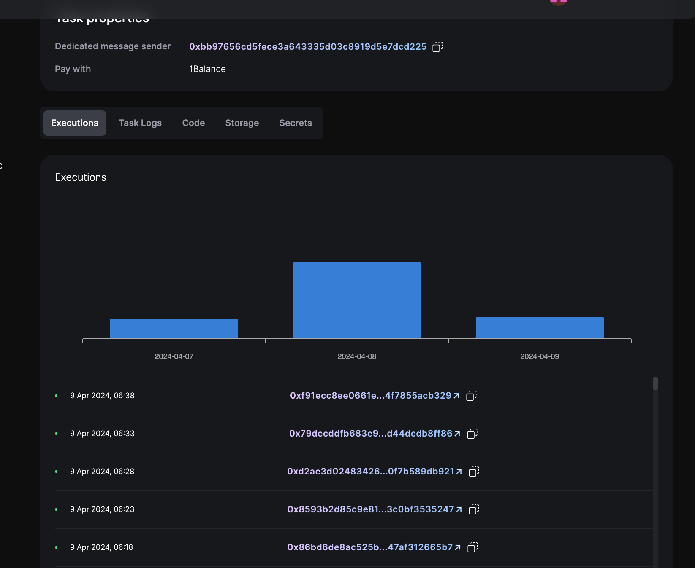

# How To #2 on Gelato: Web3 functions speed run

In this `How To` we will speed run to create our first Web3 function on [blueberry](https://raas.gelato.network/rollups/details/public/arb-blueberry), one of our [Public Rollup Testnets](https://raas.gelato.network/public-testnets)

[](https://youtu.be/QSPGlJ1B2hs)


## What are we building?

We have deployed and verified the contract [SimpleCounter](https://arb-blueberry.gelatoscout.com/address/0xf496aD5488546651C2e4635760446D9A28C2c505?tab=contract).
If you want to learn how to get started with our public testnets, learn where to get tokens, bridge them, deploy a contract, and verify it. Please visit our first video of this series, "Getting Started·

We will create a W3F that will query a "coingecko" price and will every 5 min update the price in our contract and, at the same time, increment a counter.


## How to Create a Web3 Function aka W3F?

To create a W3F we will go to the [gelato app](https://app.gelato.network/functions).


then we will choose how to trigger the W3F, what type of W3F and the params associated with this type of W3F


In our case, we have chosen a typescript W3F, so we will go ahead and create the CID of our typescript code hashed and stored on IPFS.


## How to create my W3F?
In the [web3-functions folder](./web3-functions/) you will find the available W3F, in this repo we have the `simple` W3F, please visit the [index.ts](./web3-functions/simple/index.ts). Here are the main parts of the w3f within the `Web3Function.onRun` method.

#### 1) W3F init
Provider instantiation and getting arguments

```ts
  const provider = multiChainProvider.default();

  const oracleAddress =
    (userArgs.oracle as string) ?? "0x71B9B0F6C999CBbB0FeF9c92B80D54e4973214da";
  let  oracle = new Contract(oracleAddress, SIMPLE_COUNTER_ABI, provider);
  const currency = (userArgs.currency as string) ?? "ethereum";

```
#### 2) Query Coingecho

```ts
  const provider = multiChainProvider.default();

  const oracleAddress =
    (userArgs.oracle as string) ?? "0x71B9B0F6C999CBbB0FeF9c92B80D54e4973214da";
  let  oracle = new Contract(oracleAddress, SIMPLE_COUNTER_ABI, provider);
  const currency = (userArgs.currency as string) ?? "ethereum";

```

#### 3) Sending the tx2 on chain

```ts
return {
    canExec: true,
    callData: [
      {
        to: oracleAddress,
        data: oracle.interface.encodeFunctionData("updatePrice", [price]),
      },
      {
        to:oracleAddress,
        data: oracle.interface.encodeFunctionData("increment", []),
      }
    ],
  };

```

## How to create the CID and create the W3F task

We will use the W3F command to deploy to IPFS

```ts
npx w3f deploy web3-functions/simple/index.ts
```
And we will get the following output

```ts
 ✓ Web3Function deployed to ipfs.
 ✓ CID: Qmd7if5cjdSxa6Q7txpeRWDEEDSCe4WpyJSxej3ip5wHFH
```
Now, we will grab the CID and are ready to create our W3F task.

If we continue the process started above, and input our arguments, and click `create` we can see our W3F task summary


and for instance, the summary of executions




## How to test the W3F

We have two alternative ways of testing our W3F locally. We also have the option to deploy the W3F and create the tasks on the testnet.

#### 1) Using hardhat and the W3F plugin --> E2E

We provide in the `@gelatonetwork/automate-sdk` a hardhat plugin; we will instantiate it by creating the following object at the top of our `hardhat.config.ts` config:

```ts
return {
  w3f: {
    rootDir: "./web3-functions",
    debug: false,
    networks: ["hardhat","blueberry"], //(multiChainProvider) injects provider for these networks
  },

```
Within the network's array, we will include the network name as declared in the `networks` object that the W3F multichainProvider will require.

Once we have set our w3f plugin we can go ahead and locally create a W3F instance and run it as we can see in the [test](./test/SimpleCounter.test.ts#L29)

```ts
 simpleW3f = w3f.get("simple");
```
and run it

```ts
userArgs = {
      currency: "ethereum",
      oracle: oracle.address,
    };
  let { result } = await simpleW3f.run("onRun",{ userArgs });
```
The W3F result will return `canExec:false` or `canExec:true`, In this later case, we will receive the `callData` to be executed on-chain.
To do that, we will instantiate the `dedicatedMsgSender` associated with our W3F creator, or in case the method is permissionless, we can use any signer and publish the callData on-chain:

```ts
const calldataPrice = result.callData[0];
    await owner.sendTransaction({
      to: calldataPrice.to,
      data: calldataPrice.data,
    });
```

So, if we run the test:

```ts
yarn test
```

The output is:
```ts
yarn run v1.22.19
$ npx hardhat test

  SimpleCounter Tests
> Updating price: 3694
> Price in contract: 3694
    ✔ canExec: true - First execution (736ms)
  1 passing (2s)
```

#### 2) Using the W3F command

A quick way to see the results of the W3F without setting the testing environment is by using the W3f command:

```ts
npx w3f test web3-functions/simple/index.ts --logs --chain-id=88153591557
```
We will pass the path to our W3F, the chainId where we are testing and the user arguments and storage if any in following files [userArgs.json](/web3-functions/simple/userArgs.json) and [storage.json](/web3-functions/simple/storage.json).

This is the output
```ts
Web3Function building...

Web3Function Build result:
 ✓ Schema: web3-functions/simple/schema.json
 ✓ Built file: /Users/javiermac/Documents/GELATO/200-TUTORIALS/how-tos-on-gelato-2-w3f-speed-run/.tmp/index.js
 ✓ File size: 0.80mb
 ✓ Build time: 93.53ms

Web3Function user args validation:
 ✓ currency: ethereum
 ✓ oracle: 0xf496aD5488546651C2e4635760446D9A28C2c505

Web3Function running logs:
> Updating price: 3698

Web3Function onRun result:
 ✓ Return value: {"canExec":true,
 "callData":[
          {"to":"0xf496aD5488546651C2e4635760446D9A28C2c505","data":"0x8d6cc56d0000000000000000000000000000000000000000000000000000000000000e72"},
          {"to":"0xf496aD5488546651C2e4635760446D9A28C2c505","data":"0xd09de08a"}
        ]}

Web3Function Runtime stats:
 ✓ Duration: 0.47s
 ✓ Memory: 71.69mb
 ✓ Storage: 0.00kb
 ✓ Network: 1 req [ DL: 6.23kb / UL:  0.59kb]
 ✓ Rpc calls: 0
```